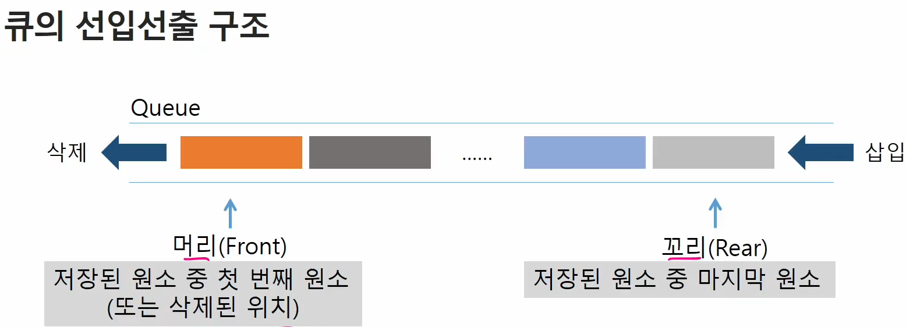

# Queue

- 스택과 마찬가지로 삽입과 삭제의 위치가 제한적인 자료구조

- 선입선출구조, 삽입한 순서대로 원소가 저장되어, 가장 먼저 삽입 된 원소는 가장 먼저 삭제 된다.
  
  - ex) 순번표 받고 줄 서서 기다리는 거

> ### 큐의 기본 연산

- 삽입 : enQueue    # push라고 쓰지말것

- 삭제 : deQueue    # pop라고 쓰지 말것

| 연산            | 기능                               |
|:-------------:|:-------------------------------- |
| enQueue(item) | 큐의 뒤쪽(rear 다음)에 원소를 삽입하는 연산      |
| deQueue()     | 큐의 앞쪽(front)에서 원소를 삭제하고 반환하는 연산  |
| createQueue() | 공백 상태의 큐를 생성하는 연산                |
| isEmpty()     | 큐가 공백상태인지를 확인하는 연산               |
| isFull()      | 큐가 포화상태인지를 확인하는 연산               |
| Qpeek()       | 큐의 앞쪽(front)에서 원소를 삭제 없이 반환하는 연산 |

## 큐의 활용 : 버퍼(buffer)

> ### 버퍼

- 데이터를 한 곳에서 다른 한 곳으로 전송하는 동안 일시적으로 그 데이터를 보관하는 메모리의 영역

- 버퍼링 : 버퍼를 활용하는 방식 또는 버퍼를 채우는 동작을 의미.

> ### 버퍼의 자료구조

- 버퍼는 일반적으로 입출력 및 네트워크와 관련된 기능에서 이용된다.

- 순서대로 입력/출력/전달되어야 하므로 FIFO 방식의 자료구조인 큐가 활용된다.
