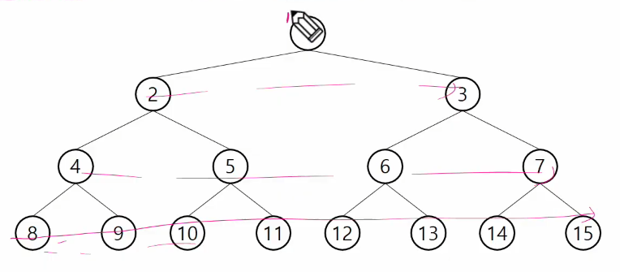
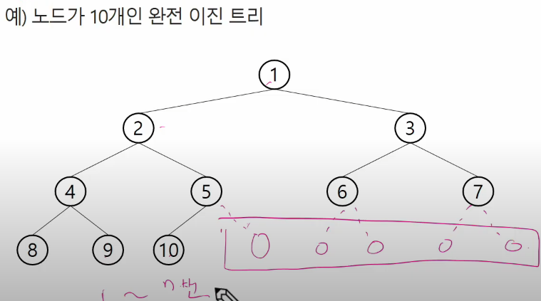
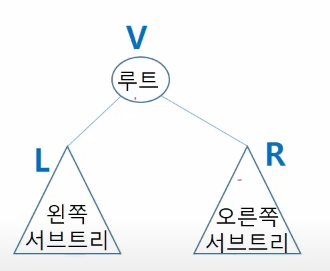
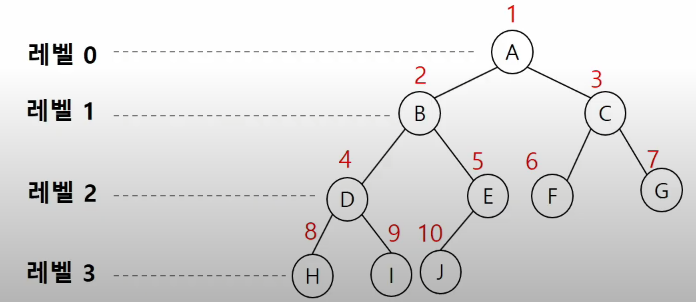
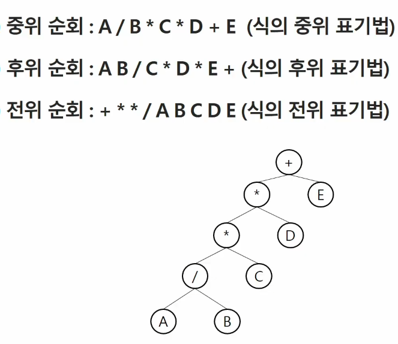

# Tree

### 트리의 개념

- 비선형구조

- 원소들 간에 1:n 관계를 가지는 자료구조

- 원소들 간에 계층관계를 가지는 계층형 자료구조

- 상위 원소에서 하위원소로 내려가면서 확장되는 트리(나무)모양의 구조

- 한 개 이상의 노드로 이루어진 유한 집합이며 다음 조건을 만족한다.
  
  - 노드 중 최상위 노드를 루트(root)라 한다.
  
  - 나머지 노드들은 n개의 분리 집합으로 분리될 수 있다.

- 이들은 각각 하나의 트리가 되며(재귀적 정의) 루트의 부 트리(subtree)라한다.

### 트리 용어정리

- 노드(node)  :  트리의 원소

- 간선(edge)  :  노드를 연결하는 선 (부모 노드와 자식 노드를 연결)

- 루트 노드(root node) : 트리의 시작 노드

- 형제 노드(sibling node) : 같은 부모 노드의 자식 노드들

- 조상 노드  :  간선을 따라 루트 노드까지 이르는 경로에 있는 모든 노드들

- 서브 트리(subtree) : 부모노드와 연결된 간선을 끊었을 때 생성되는 트리

- 자손 노드  :  서브 트리에 있는 하위 레벨의 노드들

- 차수(degree)
  
  - 노드의 차수 : 노드에 연결된 자식 노드의 수
  
  - 트리의 차수 : 트리에 있는 노드의 차수 중에서 가장 큰 값
  
  - 단말 노드(리프노드) : 차수가 0인 노드. 자식 노드가 없는 노드

### 이진트리

- 모든 노드들이 2개의 서브트리를 갖는 특별한 형태의 트리.
  
  - 단말 트리이거나 1개의 노드를 가지고 있을 수도 있다.

- 레벨 i에서의 노드의 최대 개수는 2**i개

- 높이가 h인 이진 트리가 가질 수 있는 노드의 최소 개수는 (h+1)개가 되며, 최대 개수는 ((2**h+1)-1)개가 된다.

### 포화 이진트리

- 모든 레벨에 노드가 포화상태로 차 있는 이진 트리.

- 높이가 h일 때, 최대의 노드 개수인 (2**h+1)-1 의 노드를 가진 이진 트리

- 루트를 1번으로 하여 (2**h+1)-1까지 정해진 위치에 대한 노드 번호를 가짐.
  
  

### 완전 이진 트리

- 높이가 h이고 노드 수가 n개일 때, 포화 이진트리의 노드 번호 1번부터 n번까지 빈 자리가 없는 이진트리
  
  

### 편향 이진트리

- 높이 h에 대한 최소 개수의 노드를 가지면서 한쪽 방향의 자식 노드만을 가진 이진 트리
  
  - 이진 트리 중 최악의 시간 복잡도를 가짐.

### 이진트리 - 순회

- 순회란 트리의 각 노드를 중복되지 않게 전부 방문하는 것을 말한다.

- 3가지의 기본적인 순회방법
  
  - 전위순회 - VLR
    
    부모노드 방문 후, 자식 노드를 좌, 우 순서로 방문한다. 
  
  - 중위순회 - LVR
    
    왼쪽 자식노드, 부모 노드, 오른쪽 자식노드 순으로 방문한다.
  
  - 후위순회 - LRV
    
    자식 노드를 좌우 순서로 방문한 후, 부모 노드로 방문한다.
  
  

### 배열을 이용한 이진 트리의 표현

- 이진 트리에 각 노드 번호를 다음과 같이 부여.
  
  

- 노드 번호의 성질

- 노드 번호가 i 인 노드의 부모 노드 번호? [i/2]

- 노드 번호가 i인 노드의 왼쪽 자식 노드 번호? 2*i

- 노드 번호가 i인 노드의 오른쪽 자식 노드 번호? 2*i+1

- 레벨 n의 노드 번호 시작 번호는? 2**n

### 이진 트리의 저장

- 부모 번호를 인덱스로 자식 번호를 저장.

- 자식 번호를 인덱스로 부모 번호를 저장.

- 루트찾기, 조상찾기.

### 배열을 이용한 이진 트리의 표현의 단점

- 편향 이진 트리의 경우에 사용하지 않는 배열 원소에 대한 메모리 공간 낭비 발생.

- 트리의 중간에 새로운 노드를 삽입하거나 기존의 노드를 삭제할 경우 배열의 크기 변경 어려워 비효율적

### 수식 트리

- 수식을 표현하는 이진 트리

- 수식 이진트리라고 부르기도 함.

- 연산자는 루트 노드이거나 가지 노드

- 피연산자는 모두 잎 노드
  
  

### 이진 탐색 트리

- 탐색작업을 효율적으로 하기 위한 자료구조

- 모든 원소는 서로 다른 유일한 키를 갖는다.

- key 왼쪽 서브트리  <  key 루트 노드  <  key 오른쪽 서브트리

- 왼쪽 서브트리와 오른쪽 서브 트리도 이진 탐색 트리다.

- 중위 순회하면 오름차순으로 정렬된 값을 얻을 수 있다.
