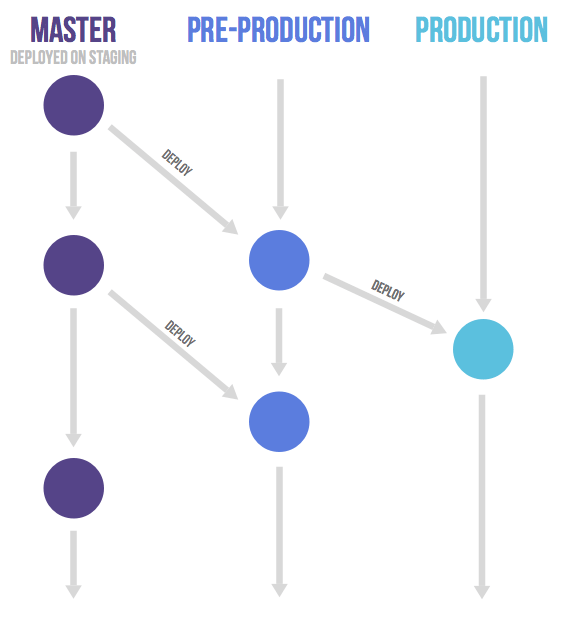

# Git Advanced

## ✔git undoing (되돌리기)

> **작업 상태에 따라 크게 세 가지로 분류!**

### Working Directory 작업 단계

- git restore = 이전 커밋 단계로 되돌리기.

- 수정한 파일 (modified된 파일)을 수정 전(직전 커밋)으로 되돌리기.

- 이미 버전 관리가 되고 있는 파일만 되돌리기 가능하다.

- 한 번 해버리면 수정한 내용은 복원할 수 없게된다.

- git restore { 파일 이름 }

- 2.23 이전 버전  =  git checkout { 파일 이름 }

- **git stash** 임시 보관하는 것. git apply하면 다시 쓸 수 있게 된다.
  
  - echo a >> b.txt (b 문서 다음 줄에 a 단어 추가)

### Staging Area 작업 단계 (git add 단계)

- git add를 잘못한 경우 working directory로 되돌리기 (==Unstage)

- root-commit 여부에 따라
  
  - root-commit 안 했을 경우 : `git rm --cached` {파일 이름}
    
    > git 저장소가 만들어지고 한 번도 커밋을 안 한 경우
    > 
    > 더 이상 관리하고 싶지 않을 때도 이걸 사용한다.
    > 
    > git rm {파일 이름} 해버리면 파일이 지워지니 주의하자.
  
  - root-commit 했을 경우 : `git restore --staged` {파일 이름}
    
    > "the contents are restored from HEAD"
    > 
    > root-commit이 있는 경우 사용(git 저장소에 한 개 이상 있는 경우)

### Repository 작업 단계 (git commit 단계)

- add, commit까지 한 경우.
  
  - `git commit --amend`
    
    - 커밋을 완료한 파일을 staging area로 되돌리기.
    
    - 상황 별로 두 가지 기능으로 나뉜다.
      
      - staging Area에 새로 올라온 내용이 없다면, <mark>직전 커밋의 메시지만 수정</mark>
      
      - staging Area에 새로 올라온 내용이 있다면, <mark>직전 커밋을 덮어쓰기</mark>
    
    > amend는 같은 브런치에서 커밋이 달라질 수 있기 때문에 여러명이서 작업할 경우에는 큰 문제가 생길 수 있다.
  
  - git reset
    
    - 시계를 마치 과거로 돌리는 듯한 행위, 프로젝트를 특정 커밋 상태로 되돌린다.
    
    - 특정 커밋으로 되돌아 갔을 때, 해당 커밋 이후로 쌓았던 커밋들은 전부 사라짐.
    
    - `git reset [옵션] {커밋 ID}`
      
      - 옵션은 soft, mixed, hard 중 하나를 작성.
        
        - --soft :: 해당 커밋으로 되돌아가고, 되돌아간 커밋 이후의 파일들은 staging  Area로 돌려놓음. 커밋 직전으로!
        
        - <u>--mixed</u> :: 해당 커밋으로 되돌아가고 되돌아간 파일들은 Working durectory로 돌려놓음! (`옵션 없을 때 reset 기본 값 === mixed`)
        
        - --hard :: 그냥 작업한거 다 없애버리고 싶을 때 hard
          
          - 다만, untracked 파일은 날아가지 않는다.
        
        - `git reflog`를 통해 내가 날린 git log들을 다시 보고 commit을 할 수 있다. 그러니까 hard를 실수로 사용했을 때 당황하지 말자 !!
          
          > `git reset --hard` (돌아가고 싶은 시점의 log 해쉬 값)
      
      - 커밋은 되돌아가고 싶은 시점의 ID를 작성.
        
        - `git log --oneline`을 썼을 때 나오는 정도의 해쉬값만 저장해놓으면 됨.

****

## ✔ Git revert

- 과거를 없었던 일로 만드는 행위로, 이전 커밋을 취소한 다음 새로운 커밋을 생성한다.

- `git revert {커밋 id}`
  
  - 취소하고 싶은 커밋 ID를 작성.

- **reset**은 커밋 내역을 삭제한다.

- **revert**는 새로운 커밋을 생성한다.

- revert는 github를 이용해 협업할 때, 커밋 내역의 차이로 인한 충돌 방지 가능.

****

## ✔ Git branch & merge

### Git branch

- 조회
  
  - `git branch` # 로컬 저장소의 브랜치 목록 확인
  
  - `git branch -r` # 리모드 저장소(원격 저장소)의 브랜치 목록 확인

- 생성
  
  - `git branch { 브랜치 이름 }` # 새로운 브랜치 생성
  
  - `git branch { 브랜치 이름 } {커밋 ID}` # 특정 커밋 기준으로 브랜치 생성

- 삭제
  
  - `git branch -d {브랜치 이름}` # 병합된(merge된) 브랜치 삭제
  
  - `git branch -D {브랜치 이름}` # 강제 삭제

- *기능개발 완료 => merge OK => branch 삭제.*

- 브랜치 변경
  
  - git switch
    
    - 현재 브랜치에서 다른 브랜치로 이동하는 명령어
    
    - `git switch {브랜치 이름}` # 다른 브랜치로 이동
    
    - `git switch -c {브랜치 이름}` # 브랜치를 새로 생성 및 이동
    
    - `git switch -c {브랜치 이름} {커밋 id}` # 특정 커밋 기준으로 브랜치 생성 및 이동.

### Git merge

- 분기된 브랜치들을 하나로 합치는 명령어

- `git merge {합칠 브랜치 이름}`
  
  - base branch(main branch)로 switch 진행 한 후 git merge를 진행한다.
  
  - 병합에는 세 종류가 존재한다.
    
    - `git merge hotfix`
    1. Fast-forward
       
       - 분기가 여러개가 아닐때.
       
       - 1번 head가 3까지이고 2번 브런치에서 3 이후로 작업된 작업물만 있고 이걸 1번에 합칠 경우.
    
    2. 3-way Merge
       
       - 각 브랜치의 커밋 두개와 공통 조상 하나로 분기되었을 경우.
       
       - 1번도 분기가 되었고 2번도 분기가 되었을 경우에.
    
    3. Merge conflict
       
       - 두 브랜치에서 같은 부분을 수정한 경우, Git이 어느 브랜치의 내용으로 작성해야 하는지 판단하지 못하여 충돌(Conflict)가 발생했을 때 이를 해결하며 병합하는 방법.

## ✔Shared repository model

- 원격 저장소가 자신의 소유이거나 Collaborator로 등록되어 있는 경우

- master 브랜치에 직접 개발하는 것이 아니라, 기능별로 브랜치를 따로 만들어 개발

- <mark>pull request</mark>를 사용하여 팀원 간 변경 내용에 대한 소통 진행.

```textile
- clone 받기

- 각자 브랜치 생성 => 작업

- 본인 브랜치에 push

- 각각의 브랜치로 push 된 것을 pull request를 통해 
  브랜치를 master에 반영(merge)해달라는 요청을 보냄.

- 머지 완료되면 브랜치 된 다른 애들은 지운다.

- 병합 완료된 마스터를 pull 받는다.

- 본인 로컬에 존재하는 브랜치도 지운다. // 여기까지 한 싸이클 !

- 완성될 때까지 무한 반복.
```

## ✔Fork & Pullmodel

- 오픈소스 프로젝트와 같이, 자신의 소유가 아닌 원격 저장소인 경우

- 원본 워격 저장소를 그대로 내 원격 저장소에 복제(이러한 행위를 `Fork`라고 함.)

- 기능 완성 후 복제한 내 원격 저장소에 push

- 이후 `pull request`를 통해 원본 원격 저장소에 반영될 수 있도록 요청함.

```textile
- ex) Fork of any open source

- 원본 저장소의 url을 remote에 등록해놓자.

- 작업해서 올린당.

- pull request를 통해 브랜치를 올린다.

- 원본에서는 이게 좋은 코드라면 병합을 한다.

- 병합되면 pull 받고 브랜치 지워주면 된다.

- 특정 오픈소스에 개발자로 기여할 수 있게 된당.
```

### git-flow

- 5개의 브랜치로 나누어 소스 코드를 관리
  
  - master : 제품으로 출시될 수 있는 브랜치
  
  - develop: 다음 출시 버전을 개발하는 브랜치
  
  - feature : 기능을 개발하는 브랜치
  
  - release : 이번 출시 버전을 준비하는 브랜치
  
  - hotfix : 출시 버전에서 발생한 버그를 수정 하는 브랜치.
    
    

### gitlab-flow

- gitlab에서 사용하는 방식.
  
  

### github-flow

- 자동화의 개념이 들어가 있다.
  
  
