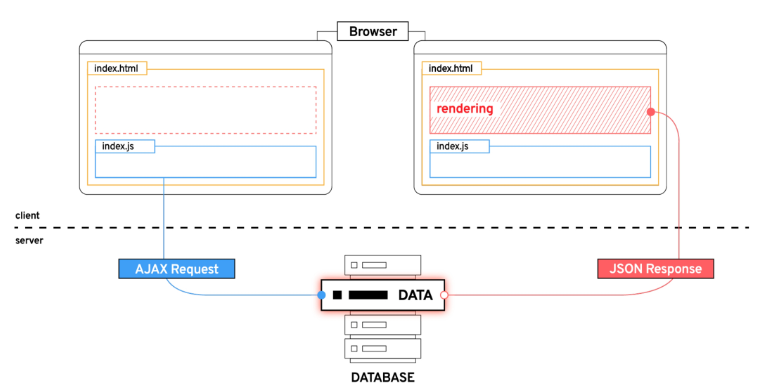
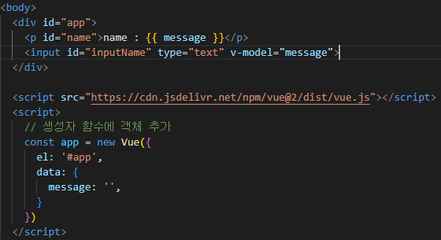

# Vue

----

### Vue intro

- Front-end Framwork
  
  - 사용자에게 보여주는 화면.
  - `Web App`을 만들 때 사용하는 도구.

- SPA (Single Page Application)
  
  - 사용자의 요청에 적절한 template를 반환하는 것이 아니라
  
  - 최초 1장의 HTML만 전달받아 모든 요청에 대응하는 방식.
    
    - `CSR`(Client Side Rendering) 방식으로 요청을 처리.

- SSR (Server Side Rendering) 이란?
  
  - 기존 요청 처리 방식.

- CSR (Client Side Rendering) 이란?
  
  - 최초 한 장의 HTML을 받아오는 것은 동일.
    
    - 단, server로부터 최초로 받아오는 문서는 빈 html문서.
  
  - 새로운 페이지를 서버에 `AJAX`로 요청
  
  - 서버는 JSON 방식으로 전달, JSON 데이터를 JavaScript로 처리, `DOM 트리`에 반영(렌더링)
    
    

- CSR 방식을 사용하는 이유.
  
  1. 응답 속도가 빠르다 :: 트래픽 감소로 인함.
  
  2. 필요한 부분만 고쳐나가므로 요청이 끊김이 없다.
  
  3. BE와 FE의 작업 영역을 명확히 분리 할 수 있다. :: 협업의 용이성.

- CSR의 단점 :
  
  - 첫 구동 시 필요한 데이터가 많으면 많을수록 최초 작동 시작까지 오랜 시간이 소요.
  - `검색 엔진 최적화`가 어려움.

- SEO (search engine optimization)
  
  - SPA도 JS를 지원하는 방식으로 발전하고 있다.

> 상황에 적절하게 CSR SSR을 사용해야한다.
> 
> - SPA서비스에서도 SSR을 지원하는 Framework가 발전하고 있다.

----

## Why Vue

- 미술쪽에 일을 하셨던 Angular 개발자 출신인 Evan You가 가볍고, 간편하게 사용할 수 있는 framework를 개발했다.

- Vue는 구조가 매우 직관적이다.
  
  - template ( HTML ), script ( javaScript ), style( css )

- Vanilla JS만으로 모든 데이터를 조작한다면 하나의 데이터를 바꾸려면 일일이 선택을 해야한다. 하지만? Vue로는 그렇게하지 않아도 된다.
  
  
  
  - CDN추가, 함수 써주고 data를 써주면? 이벤트 리스너로 하나하나 했던 것을 단순이 v-model 하나만 써서 해결해줄 수 있게 된다.

> ### Vue 2

- vue3가 2022년 초에 정식으로 나오긴했지만 아직까지 vue2 정보가 되게 많다. 때문에 vue3 대신 vue2를 쓰자!

### MVVM Pattern

- Model( JavaScript Object, JSON ), : 실제 데이터

- View( DOM ), : 우리 눈에 보이는 부분

- viewModel( Vue가 담당하는 부분! )
  
  - view를 위한 model
  
  - view와 action을 주고 받음.
  
  - model이 변경되면 view model도 변경되고 바인딩 된 view도 변경된다.
  
  - view에서 사용자가 변경을 요청하면 view model의 데이터가 변경되고 바인딩된 다른 view도 변경.

- MVC 패턴에서 controller를 제외하고 view model을 넣은 패턴.

- 독립성이 높고 의존성이 작다!

### Vue 사용하기!

- Vue instance 생성!

```html
  <!-- Vue CDN -->
  <script src="https://cdn.jsdelivr.net/npm/vue@2/dist/vue.js"></script>
  <script>
    <!-- 1. Vue instance constructor -->
    const vm = new Vue()
    console.log(vm)
```

- 생성자 함수 
  
  ```html
  
  ```

- el (element)
  
  - vue instance와 dom을 mount(연결)하는 옵션

- data
  
  - vue instance의 `데이터 객체` 혹은 `인스턴스 속성`
  
  - 반드시 기본 객체 {}(object) 여야한다.
  
  - 객체 내부의 아이템들은 value로 <u>모든 타입의 객체</u>를 가질 수 있음.
  
  - 정의된 속성은 interpolation {{}}를 통해 view에 렌더링 가능함.

- methods
  
  - method들을 정의하는 methods 객체를 만들어준다.
  
  - 이 때 method에서 쓰는 this는 해당 methods를 호출하는 객체 new를 뜻한다.
  
  > <mark>메서드를 정의할 때, Arrow Function을 사용하면 안 된다.</mark>
  > 
  > 메서드 내부의 콜백함수를 정의할 때는 써도 된다. 왜냐하면 메서드 내부에서 한 블록 위는 객체를 가리키기 때문이다.

### Basic of Syntax

- Template Syntax
  
  - 렌더링 된 DOM을 기본으로 data에 선언적으로 바인딩 할 수 있는 HTML 기반 template syntax를 사용
    
    - 렌더링 된 DOM : 브라우저에 의해 보기 좋게 그려질 HTML 코드
    
    - HTML 기반 temlplate syntax : HTML 코드에 직접 작성할 수 있는 문법 제공
    
    - `선언적으로 바인딩` : vue instance와 DOM을 연결

- Directives
  
  - 표현식이 변경될 때 반응적으로 DOM에 적용하는 것.
  
  - v-접두사가 있는 특수 속성에는 값을 할당할 수 있다.
    
    > v-on:submit.prevent="onSubmit"
    > 
    >     v-on : Name
    > 
    >     submit : Argument
    > 
    >     prevent : Modifiers
    > 
    >     onSubmit : Value
  
  - v-text && v-html
    
    ```html
    
    ```
  
  - v-show && v-if
    
    - v-if의 경우는 isActive값이 false이면 개발자도구에서도 볼 수 없다.
    
    - 즉, dom트리에서 삭제되는 것.
    
    - 토글이 많은 컨텐츠라면 v-show가 유리할 것이고
    
    - 초기 렌더링만 적으면 된다면 v-if가 좋다.
      
      \+ if else문을 쓰기 위해서는 v-if를 사용해야한다.
    
    ```html
    
    ```
  
  - v-for
    
    ```html
    
    ```
  
  - 특수 속성 Key
    
    - `v-for 사용 시 반드시 key 속성을 각 요소에 작성`
    
    - 배열에서는 키로 쓸 것이 없기 때문에 임의로 key값을 index로 쓰는 경우가 많다. 이 때 v-for가 페이지 내에 여러개일 경우 index를 key로 하는 v-for가 여러개라면 오류가 생길 수도 있느니 ``으로 문자-&{index} 형태로 써줘야한다.
  
  - v-on
    
    - ':'을 통해 전달된 인자에 따라 특별한 modifiers가 있을 수 있다.
    
    - '@' shortcut을 제공해준다.
  
  - v-bind
    
    - JavaScript의 속성값을 넣기위해 사용되는 것.
    
    - ':' shortcut을 제공해준다.
  
  - v-model
    
    - 양방향 바인딩

### Vue advanced

- computed
  
  - 종속대상의 변화에 따라 계산 여부가 결정된다.
  
  - 종속 대상이 변화하면 바꿈.
  
  - 바뀌지 않는다면 같은 값을 계속 반환해준다.

- watch
  
  - 특정 데이터의 변화를 감지하는 기능.
    
    1. watch 객체를 정의
    
    2. 감시할 대상 data를 지정
    
    3. data가 변할 시 실행 할 함수를 정의
  
  - 디버깅 용도!

- filters

- 