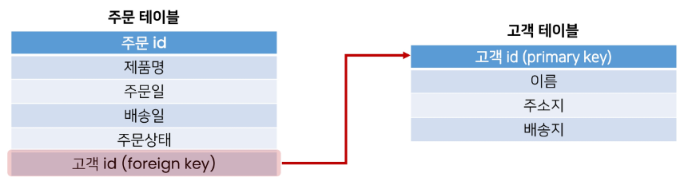
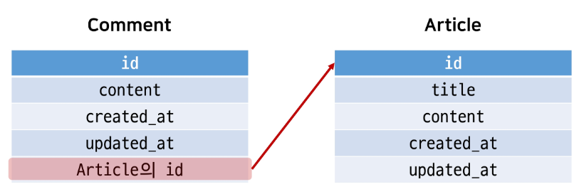
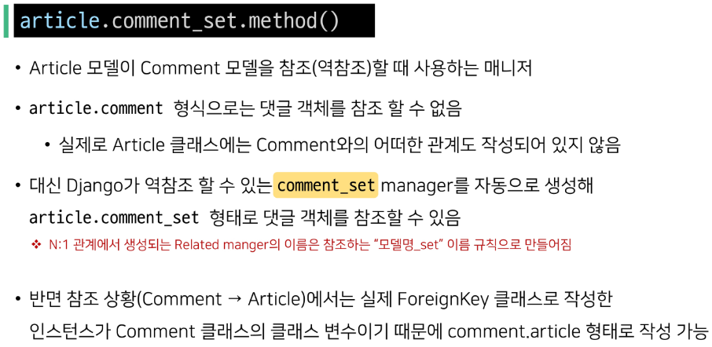
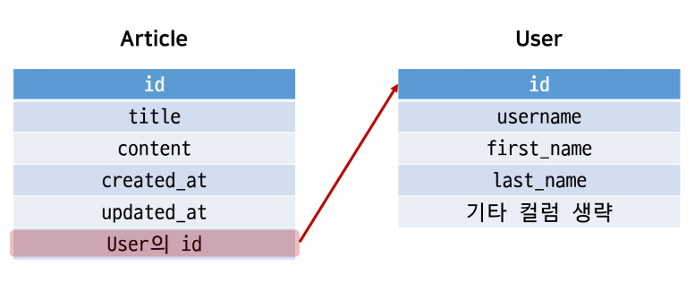
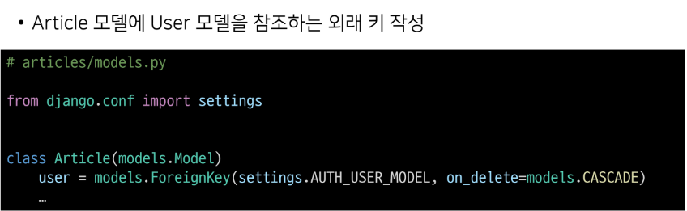

# DB 2일차.

> ### RDB(관계형 데이터베이스)

- 데이터를 테이블, 행, 열 등으로 나누어 구조화하는 방식

- RDB의 모든 테이블에는 행에서 고유하게 식별 가능한 기본 키라는 속성이 있으며, <mark>외래 키</mark>를 사용하여 각 행에서 서로 다른 테이블 간의 관계를 만드는 데 사용할 수 있음.
  
  
  
  - 테이블 간의 관계 예시 그림 1)

- 공유된 고객 id를 기반으로 연결된다.

****

### Foreign Key

- 외래 키

- 다른 테이블의 행을 식별할 수 있는 키

- 참조되는 테이블의 기본 키(PK)를 가리킴.

- 반드기 기본 키일 필요는 없지만 <mark>무조건 유일한 값이어야함</mark>.

- 2개의 필수 위치 인자가 필요
  
  1. 참조하는 <mark>model class</mark>
  
  2. <mark>on_delete</mark> 옵션
     
     - CASCADE : 부모 객체가 삭제 됐을 때 이를 참조하는 객체도 삭제
     
     - PROTECT, SET_NULL, SET_DEFAULT 등 여러 옵션 값들이 존재

- ForeignKey 인스턴스는 클래스 이름의 단수형으로 작성할 것.
  
  - migrate 로 생성된 컬럼의 이름이 인스턴스_id로 생성되기 때문에 명시적인 모델 관계 파악을 위해 단수형이 권장된다.

****

### 모델 관계 N:1

ex) 댓글과 글, 글과 작성자의 관계.

- 댓글과 글의 관계
  
  

****

### 데이터 무결성

- 데이터의 정확성과 일관성을 유지하고 보증하는 것.

- 데이터베이스나 RDBMS의 중요한 기능

- 무결성 제한의 유형
  
  1. 개체 무결성
  
  2. 참조 무결성
  
  3. 범위 무결성

****

### 관계 모델 참조

> ### Related manager

- N:1 or M:N 관계가 설정되면 역참조할 때에 사용할 수 있는 manager를 생성.
  
  - objects라는 매니저를 통해 queryset api를 사용한 것처럼 
    
    related manager를 통해 queryset api를 사용할 수 있게 됨.

> ### 역참조

- 나를 참조하는 테이블을 참조하는 것.

- N:1 관계에서는 1이 N을 참조하는 상황.
  
  - 외래 키를 가지지 않은 1이 외래 키를 가진 N을 참조
    
    

- related_name='바꿀 이름' 옵션을 통해 매니저 이름을 변경 할 수 있음.

****

### Django에서 User 모델을 참조하는 방법

1. settings.AUTH_USER_MODEL
   
   - 반환 값 : 'accounts.User' (문자열)
   
   - User 모델에 대한 외래 키 또는 M:N 관계를 정의 할 때 사용
   
   - <mark>models.py의 모델 필드에서 User모델을 참조할 때 사용</mark>

2. get_user_model()
   
   - 반환 값 : User Object (객체)
   
   - 현재 active된 User 모델을 반환
   
   - 커스터마이징한 User 모델이 있을 경우 Custom User 모델을 반환.
   
   - <mark>models.py가 아닌 다른 모든 곳에서 유저 모델을 참조할 때 사용.</mark>
     
     
     
     - Article과 User간 모델 관계 설정하는 방법.
       
       

****

### OS_1:N 기본 사용 예제

```python
@ require_POST
def comment_create(request, article_pk):
    if not request.user.is_authenticated:
        return redirect('accounts:login')
    #게시글 정보 가지고 오는 line 7
    # get_object_or_404(찾으려는 모델 클래스, 찾는 조건(유니크한 값으로 검색))
    article = get_object_or_404(Article, pk=article_pk)
    # POST가 있는 경우는 사용자가 입력한 데이터가 있다는 뜻.
    comment_form = CommentForm(request.POST)
    if comment_form.is_valid():
        comment = comment_form.save(commit=False) # not null constrait false error 처리.
        comment.author = request.user             # 로그인 정보가 들어있음!
        comment.article = article
        comment.save()
        return redirect('articles:detail', article.pk)
    
    context = {
        'article': article,
        'comment_form': comment_form,
        # 데이터가 유효성 검사를 통과하지 못했을 때 에러 정보와 함께 
        # 사용자의 입력을 다시 받기 위해 전달되는 친구.
    }
    return render(request, 'articles/detail.html', context)
    # 리다이렉트면 pk가 같이 넘어가지만, render의 경우 그렇지 않기 때문에
    # article 정보를 전달해준다. (context)
```


